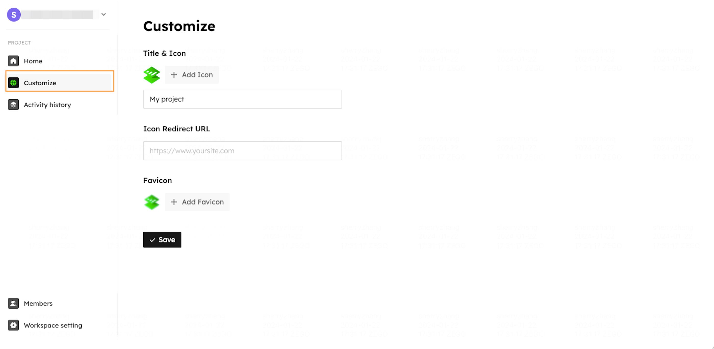

# Customize through platform

You can set your website title, header logo with its redirect url,  and favicon in your project **Customize** tab with ease.

<Frame width="auto" height="auto" >
  
</Frame>

Once you save your customization settings, The will be updated to your website.

